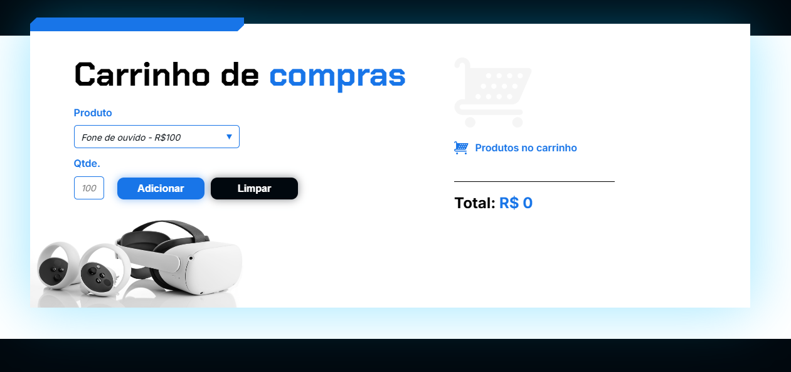

# Projeto Carrinho: Projeto Carrinho

* Breve Resumo:

Projeto de javascrip com funcionalidade de adicionar itens ao carrinho, com uma lista predefinida lança diretamente no HTML onde ao cliencar no botão adicionar, os itens caem no carrinho mostrando quantidade, valor unitário e total da compra logo a baixo, em seguida desenvolvemos a funcionalidade do botão limpar, onde são zerados todos os itens do carrinho.

* Funcionalidades e Demonstração do Site

Tela principal:

Tela ao lançar itens:

* Tecnologias utilizadas

  * HTML - HyperText Markup Language
  * CSS - Cascading Style Sheets
  * JavaScript

* Pessoas Desenvolvedoras do Projeto

  Autores

| [ Ericson Nascimento](https://github.com/ericsonnascimento) |
| :---: |