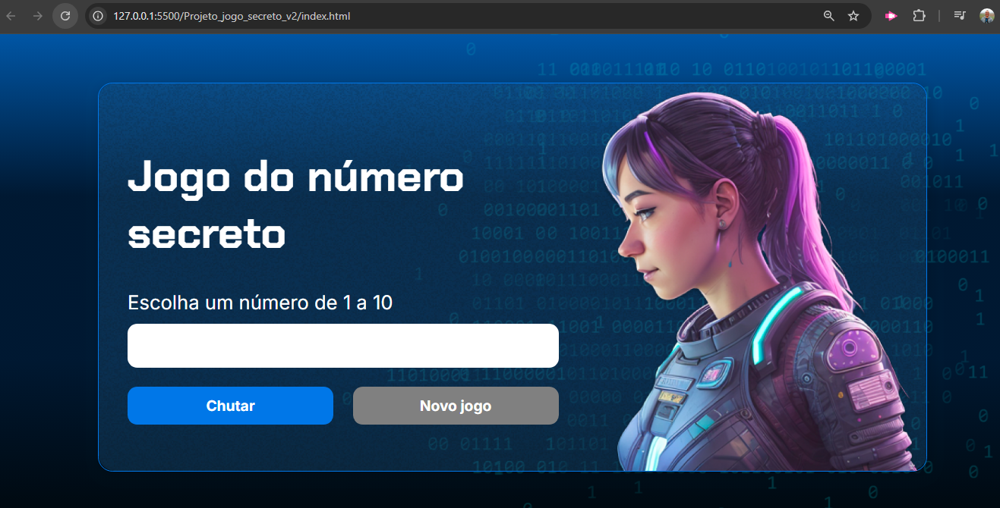

# Projeto Jogo Secreto v2: Jogo que permite o usuário tentar adivinhar o número secreto em X tentativas

* Breve Resumo:

Jogo interativo em JS que permite o usuário acertar o número secreto retornando quantas tentativa foram realizadas, intruduzido narração em audio.

* Funcionalidades e Demonstração do Site

Tela principal:

Tela pós uso:

* Tecnologias utilizadas

  * HTML - HyperText Markup Language
  * CSS - Cascading Style Sheets
  * JavaScript

* Pessoas Desenvolvedoras do Projeto

  Autores

| [ Ericson Nascimento](https://github.com/ericsonnascimento) |
| :---: |