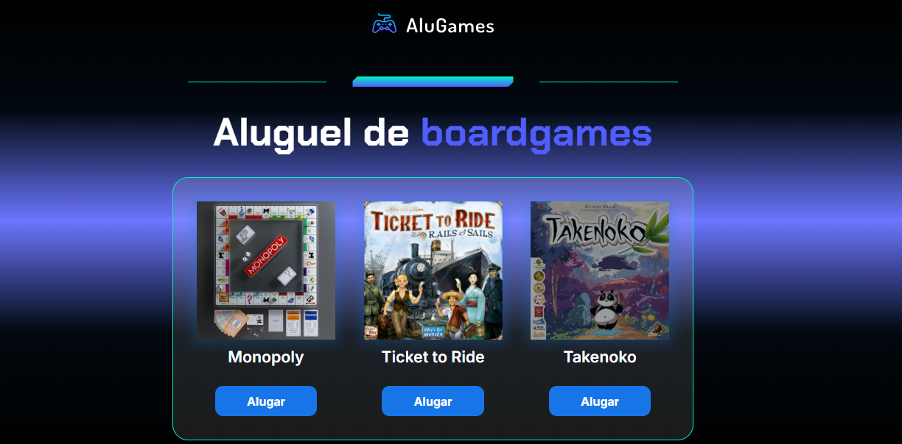
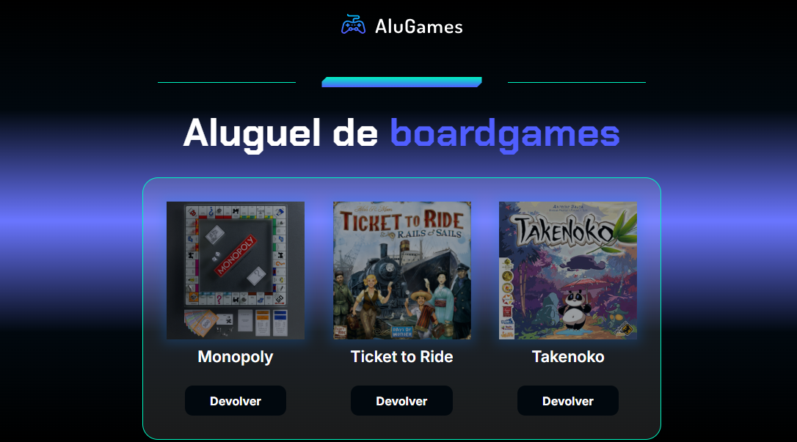
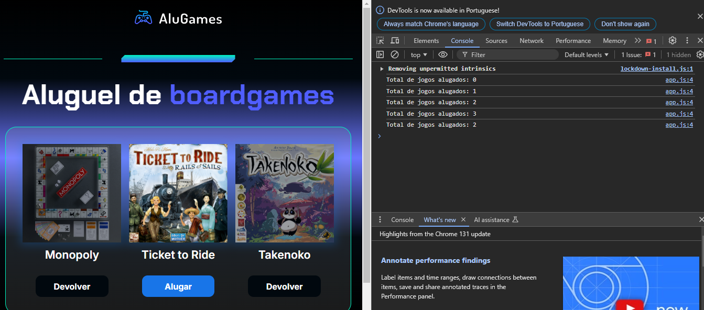
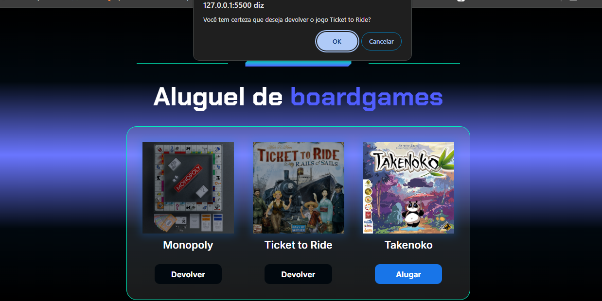

# Projeto Alugames: Projeto para locação de jogos de tabuleiro

* Breve Resumo:

Projeto de javascrip com funcionalidade de deixar a imagem opaca, botão cinza, e modificar o texto do botão de Alugado para Devolver ao clicar em um dos jogos disponíveis, implantada a função de "confirm" quando clicar em devolver jogo e criado um contador informando quantos jogos foram locador ou devolvidos no console.log.

* Funcionalidades e Demonstração do Site

Tela principal:

Tela pós uso:

Console.log:

Deseja devolver?

* Tecnologias utilizadas

  * HTML - HyperText Markup Language
  * CSS - Cascading Style Sheets
  * JavaScript

* Pessoas Desenvolvedoras do Projeto

  Autores

| [ Ericson Nascimento](https://github.com/ericsonnascimento) |
| :---: |