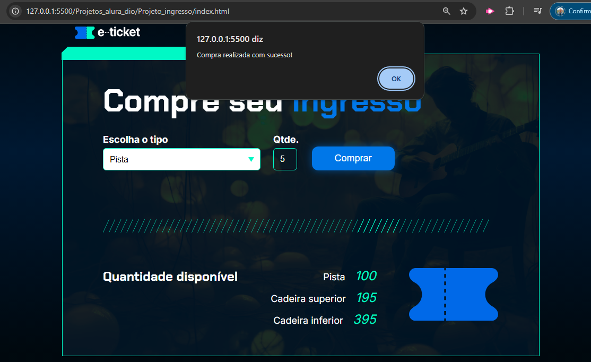

# Projeto Ingesso: Projeto voltado a compra de Ingressos

* Breve Resumo:

Projeto de javascrip com funcionalidade de compra de ingressos separando por tipo, pista, inferior ou superior decrescendo o valor disponível em estoque.

* Funcionalidades e Demonstração do Site

Tela principal:

Tela ao lançar compras:

* Tecnologias utilizadas

  * HTML - HyperText Markup Language
  * CSS - Cascading Style Sheets
  * JavaScript

* Pessoas Desenvolvedoras do Projeto

  Autores

| [ Ericson Nascimento](https://github.com/ericsonnascimento) |
| :---: |