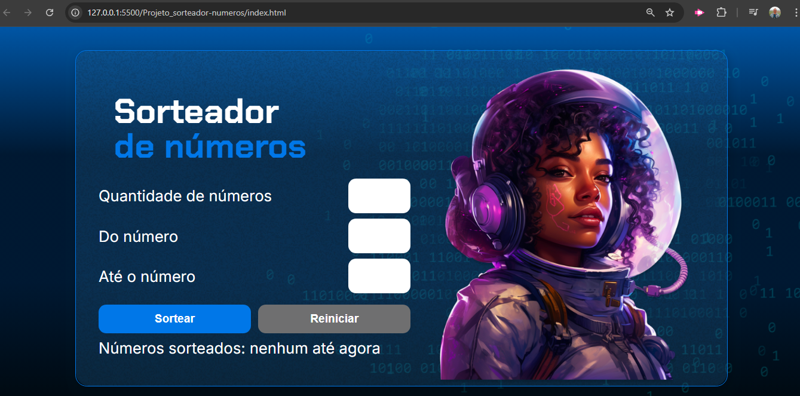

# Projeto Sorteador de Números: Website que sorteia uma faixa de números aleatoriamente, usuário passa a quantitade.

* Breve Resumo:

Projeto de javascrip de sorteio de números aleatórios

* Funcionalidades e Demonstração do Site

Tela principal:

Tela pós uso:

* Tecnologias utilizadas

  * HTML - HyperText Markup Language
  * CSS - Cascading Style Sheets
  * JavaScript

* Pessoas Desenvolvedoras do Projeto

  Autores

| [ Ericson Nascimento](https://github.com/ericsonnascimento) |
| :---: |